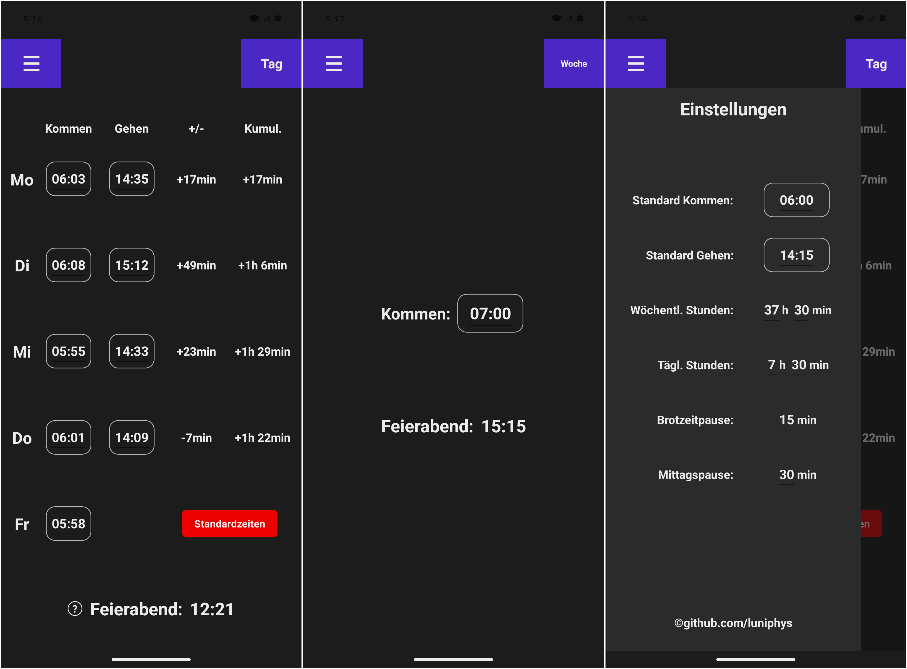

[](https://dotnet.microsoft.com/en-us/)
[](https://learn.microsoft.com/en-us/dotnet/csharp/)
[](https://dotnet.microsoft.com/en-us/apps/maui)
[](LICENSE)

# Flextime Calculator

A cross-platform .NET MAUI app for workers to track their weekly working time. Enter beginning and ending working times for each workday and the app calculates daily overtime or deficit, cumulative weekly overtimes/deficits, and the earliest possible ending time on Friday (german: "Feierabend").

<br/>

<p align="center">
    
</p>

## Table of Contents

- [Overview](#overview)
- [Features](#features)
- [Project Structure](#project-structure)
- [Requirements](#requirements)
- [Build & Run](#build--run)
- [License](#license)

## Overview

The first time starting the app, a setup wizard runs where the user sets their usual begin/end working times, total weekly hours, and break durations. These settings are persisted across sessions via MAUI's `Preferences`.

The main screen has two views:

1. **Week view** — Enter working times from Monday to Friday morning. The app calculates daily and cumulative overtimes/deficits by the needed daily hours and determines the earliest time one can leave on Friday to fulfill the weekly hours.
2. **Day view** — Enter a single begin time and get the earliest end of work time for that day based on the daily needed hours.

A slide-in settings panel lets you adjust usual beginning/ending times weekly and daily hours, and break times.

## Features

- First-time setup wizard for initial configuration
- Week view with Mon–Fri inputs
- Daily and cumulative time deltas
- Automatic Friday end of work time calculation
- Day view for single-day end of work time calculation
- Configurable usual beginning/end times, weekly hours, and break durations in settings panel
- Restore button to reset all times to usual times.
- All time states stored across app restarts

## Project Structure

```
src/flextime-calculator/    # .NET MAUI app source
docs/                       # Documentation assets
```

## Requirements

- [.NET 10 SDK](https://dotnet.microsoft.com/download)
- **.NET Multi-platform App UI development** (MAUI)

## Build & Run

Clone the repository:

```sh
git clone https://github.com/luniphys/flextime-calculator
cd flextime-calculator
```

Run for a specific target platform:

```sh
# Android
dotnet run --project src/flextime-calculator -f net10.0-android

# Windows
dotnet run --project src/flextime-calculator -f net10.0-windows10.0.19041.0

# iOS (requires macOS)
dotnet run --project src/flextime-calculator -f net10.0-ios
```

To build without running:

```sh
dotnet build
```

## License

MIT © [luniphys](https://github.com/luniphys)
