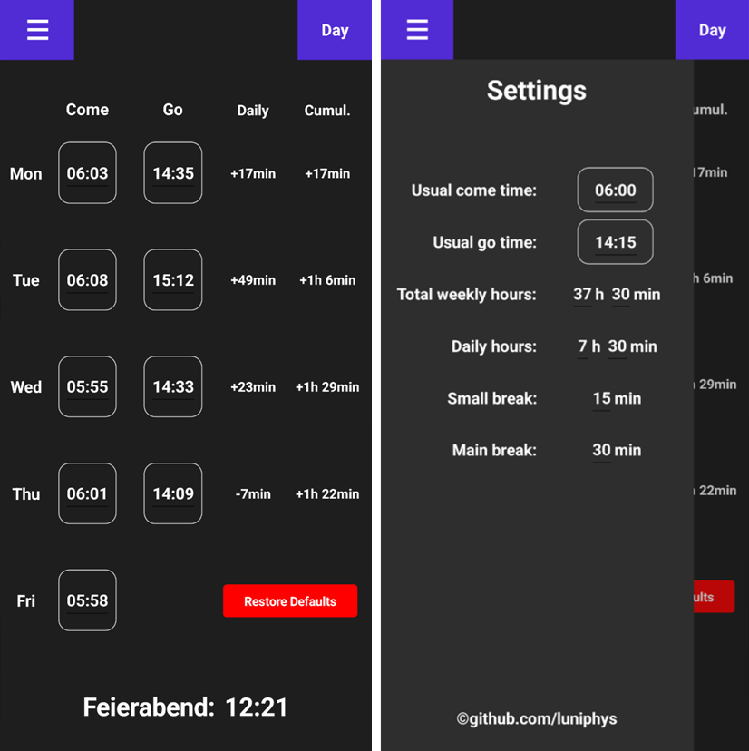

[](https://dotnet.microsoft.com/en-us/)
[](https://learn.microsoft.com/en-us/dotnet/csharp/)
[](https://dotnet.microsoft.com/en-us/apps/maui)
[](LICENSE)

# Flextime Calculator

This project is a small flex-time tracking app for employees to manage their weekly working hours. Users can enter their arrival and departure times for each day, while the app calculates overtime or missing hours throughout the week. Based on the accumulated hours, the app dynamically updates and displays the earliest possible leaving time for Friday.

<br/>

<p align="center">
    
</p>

## Table of Contents

- [Overview](#overview)
- [Features](#features)
- [Project Structure](#project-structure)
- [Requirements](#requirements)
- [Build & Run](#build--run)
- [License](#license)


## Overview

Summary

The program pipeline is:

1. Step1
2. Step2


## Features

- Feature1
- Feature2


## Project Structure

```
src/flextime-calculator/    # description
docs/                       # description
```


## Requirements

- Windows
- [.NET 10 SDK](https://dotnet.microsoft.com/download)
- MAUI Package


## Build & Run

Clone the repository and run the application from the solution root:

```sh
git clone https://github.com/luniphys/flextime-calculator
cd flextime-calculator
dotnet run --project src/flextime-calculator
```

To build without running:

```sh
dotnet build
```

## License

MIT © [luniphys](https://github.com/luniphys)
